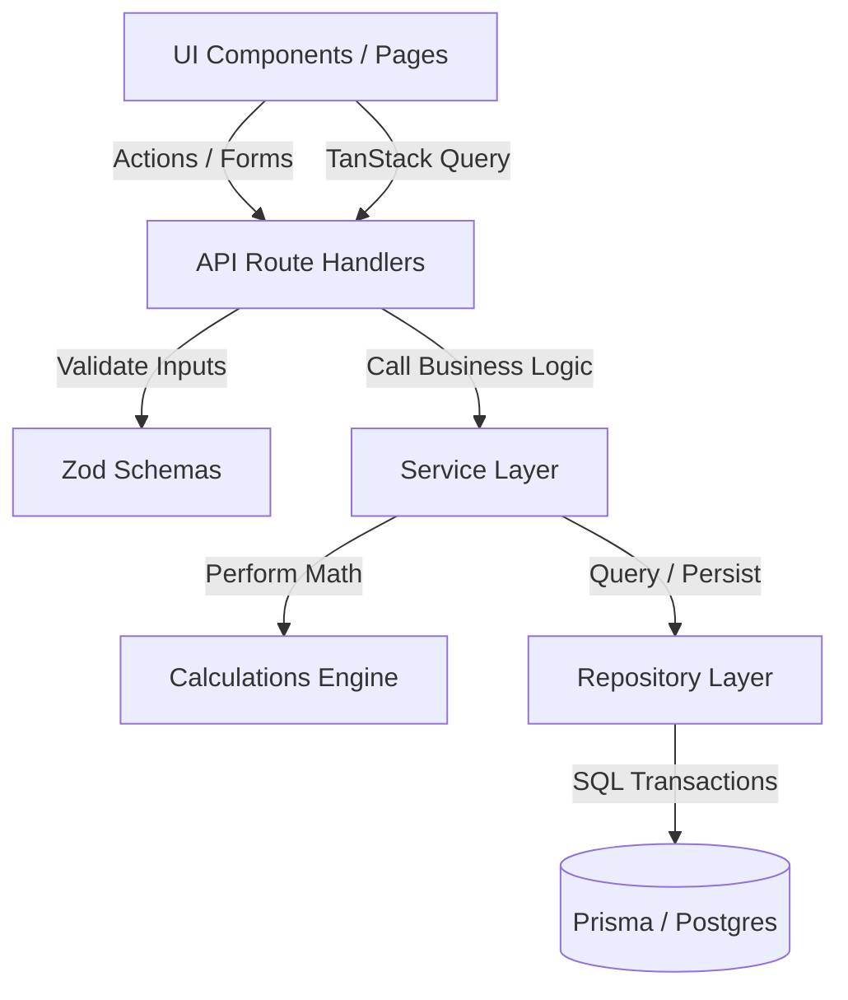

# System Architecture

This document describes the architectural patterns and boundaries of the BudgetFlow personal finance web application.

## Layers and Responsibilities

### 1. Presentation Layer (`src/app/`)
* **Server Pages**: Responsible for initial authentication checks, loading initial page data securely via the Service Layer, and pre-rendering layouts. This prevents loading flashes on client-side mount.
* **Client Pages & Components**: Client components handle UI interactions, forms validation, search states, and manual pagination resets. They communicate with API routes exclusively.
* **State Management**: TanStack Query is used exclusively to fetch, cache, and mutate data dynamically on interactive sub-views.

### 2. Validation & Security (`src/features/`)
* Input validation is decoupled from controllers and repositories using **Zod Schemas**. All incoming network request body structures are validated strictly at the edge of the API route.
* Routes are guarded server-side using Auth.js. Redirects for unauthenticated requests are executed inside Next.js layouts and proxy hooks.

### 3. Service Layer (`src/server/services/`)
* Serves as the central repository for **business logic**.
* Performs category-type compatibility checks, timezone calculations, budget rollup configurations (like food grouping), and triggers atomic database operations.
* Exposes clean JavaScript objects/types to the API route controllers and Server Components.

### 4. Calculations Engine (`src/server/calculations/`)
* A pure functions library that performs financial math (rollover fees, remaining margins, budget percentages).
* Enforces the use of `decimal.js` for all calculations, converting variables safely to Decimal values.

### 5. Repository Layer (`src/server/repositories/`)
* The **only** layer allowed to make queries using the Prisma client (`db`).
* Contains no business rules or state validations. It is responsible for raw database execution, query pagination limit guards (max 100), and transaction scopes.
