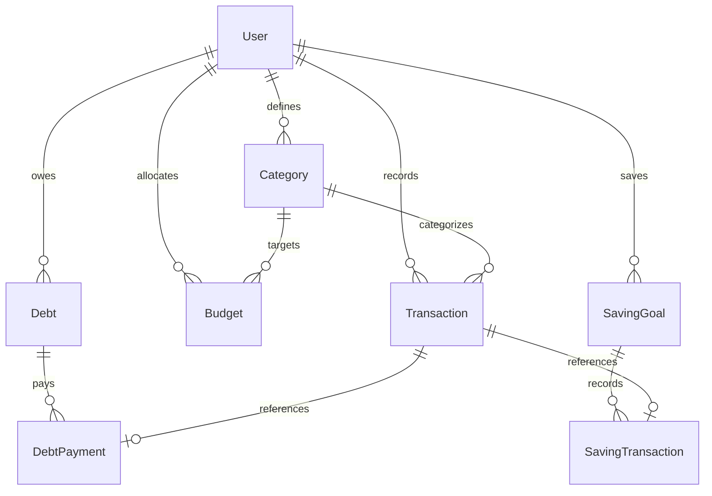

# Database Schema

BudgetFlow uses PostgreSQL as its primary datastore, managed via Prisma ORM.

## Schema Map

## Enum Definitions

### `CategoryType`
* **`INCOME`**: Salaries, freelance payments, interest.
* **`FIXED_EXPENSE`**: Rent, utilities, subscriptions.
* **`VARIABLE_EXPENSE`**: Food, shopping, travel.
* **`SAVINGS`**: Saving accounts, goal deposits.
* **`DEBT`**: Credit card balances, loans.
* **`REMITTANCE`**: Money transfers to family.

### `TransactionType`
* **`INCOME`**: Incoming money.
* **`EXPENSE`**: Outgoing payments.
* **`SAVINGS`**: Savings transfers.
* **`DEBT_PAYMENT`**: Debt service payments.
* **`TRANSFER`**: General transfers (e.g. remittances).

### `SavingTxType`
* **`DEPOSIT`**: Adding money to a savings goal.
* **`WITHDRAWAL`**: Withdrawing money from a savings goal.

---

## Core Models

### `User`
Stores user profile credentials.
* `id` (UUID): Primary key.
* `email`: Unique.
* `passwordHash`: Hashed string (bcryptjs).

### `Category`
User-defined category tags for transaction classification.
* `id` (UUID): Primary key.
* `name`: Category name. Unique under `[userId, name]`.
* `type`: `CategoryType`.
* `budgetGroupKey`: Custom key (e.g. `"FOOD"`) to aggregate multiple sub-categories.

### `Transaction`
Cash ledger entries.
* `id` (UUID): Primary key.
* `date`: DateTime (UTC).
* `amount`: Decimal(12, 2).
* `type`: `TransactionType`.
* Indexed on `[userId, date]` and `[categoryId]` for ledger retrieval performance.

### `Budget`
Target monthly caps.
* `id` (UUID): Primary key.
* `amount`: Decimal(12, 2).
* `month`: String in YYYY-MM format.
* Unique index on `[userId, categoryId, month]` to prevent duplicate configurations.
