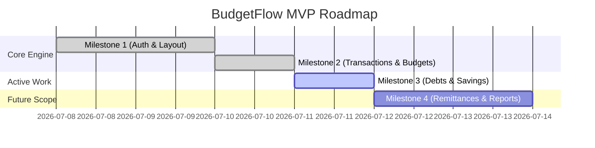

# Application Roadmap

This roadmap lists the development milestones for the BudgetFlow personal finance application.

## Milestone Overview

### [x] Milestone 1: Authentication & Layout
* Email and password login via Auth.js.
* Redirection proxy validation middleware.
* Responsive dashboard layout structure.

### [x] Milestone 2: Transactions & Budgets
* Transaction ledger CRUD.
* Monthly budget allocation caps.
* actuals spent calculations.
* Dynamic daily food allowance grouping.

### [/] Milestone 3: Debts & Savings (Current)
* Multiple debt balances tracking and payment logs.
* Projected debt schedules using rollover fee math.
* Savings goals tracking (deposits & withdrawals).
* Reconciling payments/deposits with the main ledger.

### [ ] Milestone 4: Remittances & Reports
* Philippines remittance helper with exchange rate conversions and fees.
* Expense category allocation summaries (pie charts, trend indicators).
* PDF statement exports.
